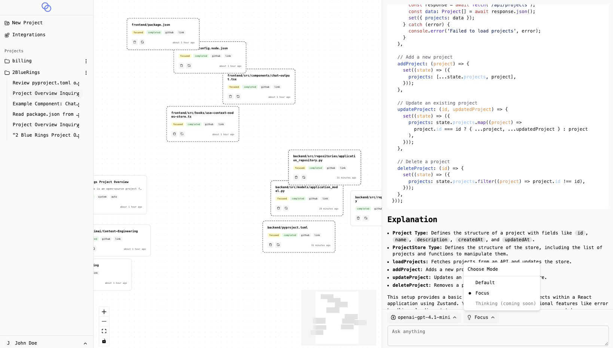
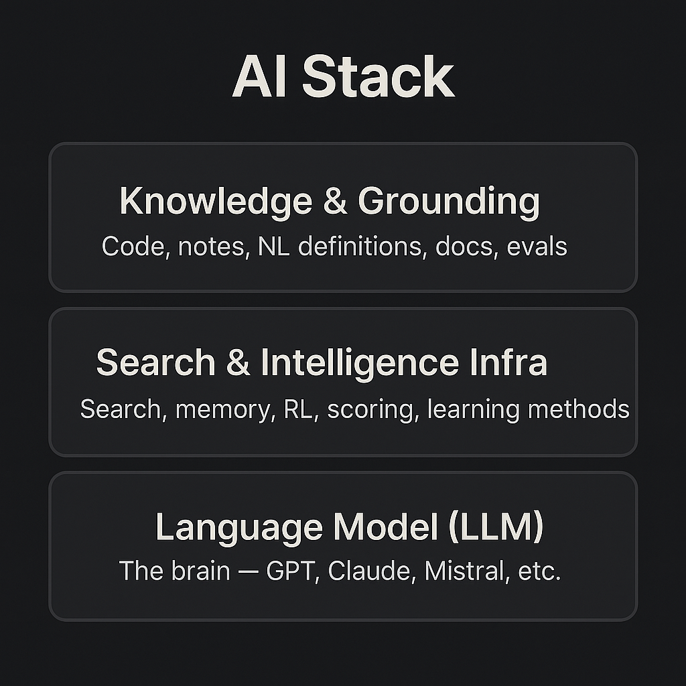

  

<h1 align="center">
  2 Blue Rings
</h1>
<h2 align="center">
  A single source of context. A single source of truth. Consolidate everything, AI handles the rest.
   
</h2>

  

  <a href="https://www.youtube.com/watch?v=TNFCp5beOMo" target="_blank">
    Watch Demo
  </a>

### Context Engineering & Design
We are an open-source project that aims to give users full control over the **intelligence layers above the LLM**. Bring your own models, define your own context, and shape how your assistant learns and retrieves information — all in one unified interface. With multiple integrations supported, you can teach your LLM to answer using data from Github, Confluence, Jira, Slack and more. This is your centralized professional daily driver, note taker, project manager, planner or whatever you want it to be. Since you control the context, you control how the LLM behaves.

---

### 🧱 The AI Stack

Conceptually the current AI stack could be thought as follows:

The top 2 layers should be customizable and open. The LLM should be swappable so that your context, memories, notes are all in your control.

---

## ✨ Key Features

- 🔍 **Context Pane** – View and manage live project context: docs, notes, code, threads, messages.
- 💬 **Chat with Contextual Memory** – Threads retain context, build memory, and improve grounding. Focus on specific contexts
- 💬 **Integrations** – Add API keys to pull in data from Github, Confluence & more.
- 💬 **Project Management** – Single source of truth for a project or a feature.
- 🧩 **BYO LLM** – Works with GPT-4, Claude, Mistral, Groq, or your own hosted models.
- 🧰 **API-first, Developer-ready** – Designed for engineers to hack, plug in, and extend.
---

## 🔌 Supported Integrations

| Integration   | Type     | Supported | Notes                                                                                                   |
| ------------- | -------- | --------- | ------------------------------------------------------------------------------------------------------- |
| **Slack**     | Tool     | ❌         | Coming soon                                                                 |
| **Atlassian** | Tool     | ✅         | Use API token + domain + username ([docs](https://id.atlassian.com/manage-profile/security/api-tokens)) |
| **GitHub**    | Tool     | ✅         | Use a personal access token ([docs](https://github.com/settings/personal-access-tokens))                |
| **Tavily**    | LLM Tool | ✅         | Requires API key ([docs](https://app.tavily.com/home))                                                  |

## 🤖 LLMs Providers

| Provider      | Model                                                                                                                                                                                                                                                                                                                                   | Supported   |
| ------------- | --------------------------------------------------------------------------------------------------------------------------------------------------------------------------------------------------------------------------------------------------------------------------------------------------------------------------------------- | ----------- |
| **OpenAI**    | gpt-5, gpt-5-mini, gpt-5-nano, gpt-4.1, gpt-4.1-mini, gpt-4.1-nano, gpt-4o, gpt-4o-mini, gpt-4                                                                                                                                                                                                                                          | ✅           |
| **Anthropic** | claude-opus-4-1, claude-opus-4-0, claude-sonnet-4-0, claude-3.7 sonnet, claude-3.5 sonnet, claude-3.5 haiku                                                                                                                                                                                                                             | ❌ (coming soon) |
| **Groq**      | qwen/qwen3-32b, llama-3.1-8b-instant, llama-3.3-70b-versatile, meta-llama/llama-4-maverick-17b-128e-instruct, meta-llama/llama-4-scout-17b-16e-instruct, meta-llama/llama-guard-4-12b, meta-llama/llama-prompt-guard-2-22m, meta-llama/llama-prompt-guard-2-86m, deepseek-r1-distill-llama-70b, openai/gpt-oss-120b, openai/gpt-oss-20b | ✅           |

## Getting Started

- Install & run the backend server: https://github.com/2bluerings/2bluerings/blob/main/backend/README.md
- Install & run the frontend server: https://github.com/2bluerings/2bluerings/blob/main/frontend/README.md

---

## License

2BlueRings is licensed under the MIT License.  
See [LICENSE](./LICENSE.md) for details.

---